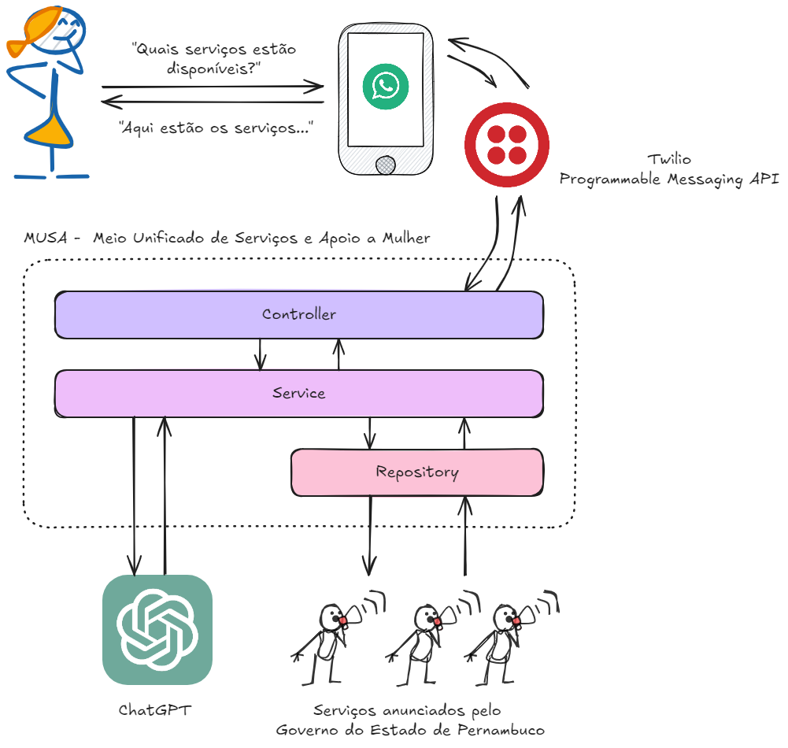

## O que é?

A MUSA (Meio Unificado de Serviços e Apoio a Mulher) é uma aplicação conversacional integrada ao WhatsApp que permite fácil acesso para o público feminino aos serviços ofertados pelo Governo do Estado de Pernambuco voltados para atendimento de mulheres em suas necessidades específicas. Basta enviar uma mensagem que ela indicará qual dos serviços disponíveis podem ajudar!

## Como funciona?

A MUSA é uma aplicação WEB em escrita em python, usando o framework Flask. Isto permite emitir requisições para esta aplicação sob quaisquer eventos. Neste escopo, graças a boa difusão do WhatsApp no Brasil, decidimos configurar a aplicação para responder a eventos originados de mensagens enviadas por este app. Então o primeiro passo para o usuário é tão simples quanto enviar uma mensagem para um contato no WhatsApp! Para integração com o WhatsApp, utilizamos a API _Programmable Messaging_ do Twilio. Para mais informações, [clique aqui](https://www.twilio.com/pt-br/blog/criar-um-chatbot-para-whatsapp-com-python-flask-e-twilio).

Ao receber a mensagem a MUSA faz o seguinte passo-a-passo:
1. na camada "Controller", ela extrai o conteúdo da mensagem para repassar para a próxima camada
2. na camada "Service", é construído um prompt, um pequeno trecho textual que vai requisitar uma resposta para esta mensagem a uma inteligência artificial. Neste projeto, utilizamos o ChatGPT 4o, da OpenAI. Este prompt vai ser composto por duas informações: a mensagem recebida e os serviços disponíveis. Então a MUSA constrói o prompt pedindo para a IA relacionar ambas as partes.
3. a camada "Repository" é a camada que armazena os serviços disponíveis. Aqui são armazenados de uma forma padronizada. Nesta versão, os serviços estão fixos no código, mas para as próximas versões estimamos ser possível fazer integrações com as bases de dados dos serviços individuais.
4. Após receber de volta a resposta da IA, a camada "Controller" envia como resposta no chat do WhatsApp.

O diagrama abaixo mostra visualmente o fluxo descrito acima.




## Como executar?

Como citado anteriormente, esta aplicação foi escrita em python, usando o framework Flask. Disponibilizamos duas formas de execução da aplicação: usando Docker ou diretamente usando python. De qualquer uma das formas, é necessário, primeiro, fazer o download deste repositório e depois criar um arquivo de ambiente, para configuração de dados sensíveis.

### Passo 1: Download do repositório

Clone o repositório do projeto em seu computador:

```shell
git clone https://github.com/imogen-health/musa.git
cd musa
```

### Passo 2: Criação do arquivo de ambiente

Na raiz do projeto, crie um arquivo chamado `.env`. Neste arquivo, é necessário, adicionar a variável de ambiente `OPENAI_API_KEY` com a API key do OpenAI. Mais detalhes de como obter essa chave [neste link](https://platform.openai.com/docs/api-reference/introduction).

Exemplo:

```env
OPENAI_API_KEY=<API key gerada na sua conta>
```

### Passo 3 (Opção 1): Execução usando Docker

Confirme que o computador dispõe de Docker instalado e em execução. Então, basta executar o seguinte comando no diretório raiz do projeto:

```shell
docker build -t musa .
docker run --rm -it -p 5000:5000 musa
```

Isto irá iniciar o servidor que responde as mensagens enviadas. 

### Passo 3 (Opção 2): Execução usando python

Antes de começar, certifique-se de ter os seguintes pré-requisitos instalados em seu sistema:

- Python 3.x
- Pip (gerenciador de pacotes do Python)

Durante o desenvolvimento, foi utilizada a versão 3.12 do python, portanto, nesta versão é garantida maior compatibilidade. Versões anteriores podem funcionar, no entanto, alguns problemas de execução podem ocorrer. Então, siga os passos a seguir 

1. Crie um ambiente virtual para isolar as dependências do projeto com o comando `python3 -m venv venv`

2. Ative o ambiente virtual:

- No Linux/Mac: `source venv/bin/activate`

- No Windows: `venv\Scripts\activate`

3. Instale as dependências do projeto usando o comando `
pip install -r requirements.txt`

4. Execute o seguinte comando para iniciar o servidor Flask
```
waitress-serve --port 5000 --call "app:create_app"
```
